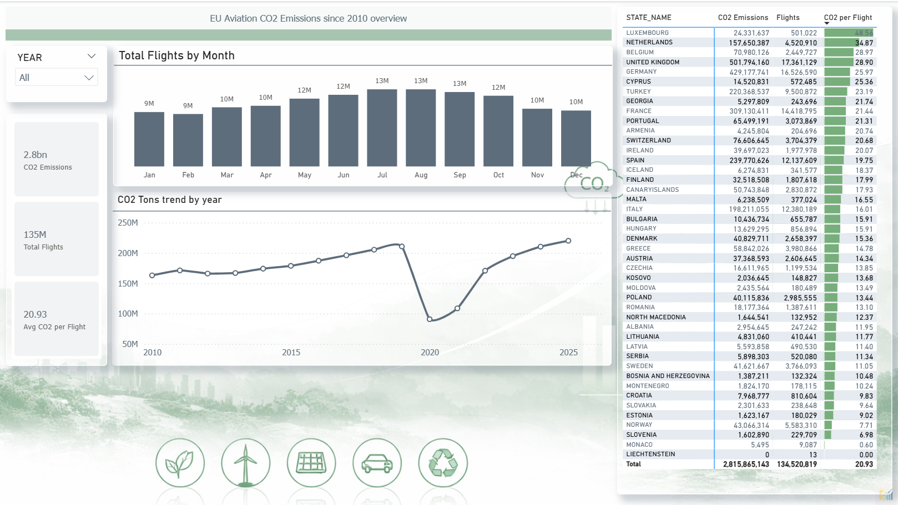

# Dashboard Overview

## Insights

- Emissions peaked before 2020  
- COVID caused a sharp drop  
- Recovery after 2021  
- Summer months have highest flights  

## KPIs

- **Total CO₂ Emissions tonnes:** ~2.8B tonnes *(varies by selected year)*  
- **Total Flights:** ~135M *(varies by selected year)*  
- **Average CO₂ per Flight:** ~20.93 tonnes *(dynamic in dashboard)*  

## 📊 Dashboard Preview

